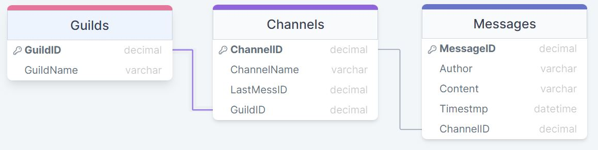

# Discord-Scraper
Take Messages from user specified discord channels and store the messages in an SQL server.

## Usage
The program takes inputted channel IDs from a `Channel_ids.txt`. Each time a new channel ID is placed in the `Channel_ids.txt`, the last 5 messages from that channel are requested. For channels already in the database on messages after the last save are requested.

## Prerequisites
The architecture of the MySQL database is as follows.



Each message is contained in a channel and each channel is apart of a guild. In order for the requests to be efficient each time messages are requests from a channel, the ID of the last messages recieved, therefore having a continuation point for when the program is run again.

## Requirements
Two library installations are required for this project. 
The first being the `requests` library and the second being `mysql.connector`.
```shell
pip install requests
pip install mysql-connector-python
```

